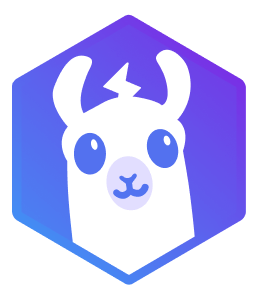
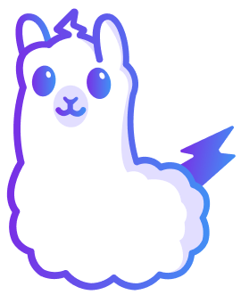

<br/>

<!--
[](https://discord.gg/VptPCZkGNa)
[](https://github.com/Lightning-AI/lit-llama/blob/master/LICENSE)
-->

# Lit-LLaMA ️

**Lit-LLaMA** is an independent implementation of [LLaMA](<https://github.com/facebookresearch/llama>) based on [nanoGPT](<https://github.com/karpathy/nanoGPT>), and released under the **Apache 2.0 license**.

**Backstory**: Meta released the original [LLaMA code](https://github.com/facebookresearch/llama) under the [GPL license](https://github.com/facebookresearch/llama/blob/main/LICENSE).
This means that any project containing LLaMA code **must be released as GPL**. We've seen LLaMA code leaking into the Apache 2.0 / BSD / MIT deep learning ecosystem, and that is an actual problem. **Lit-LLaMA solves that for good.**

**Lit-LLaMA** is:

- **Simple**, single-file, no boilerplate
- **Numerically equivalent** to the original model
- **Optimized** to run on consumer hardware or at scale
- **Open-source** no strings attached

Interested in **making this perfect together**? [Join our Discord](https://discord.gg/VptPCZkGNa)!

## Installation

### Clone the repo

```bash
git clone https://github.com/Lightning-AI/lit-llama
cd lit-llama
```

### Create a new Python environment

With `venv`

```bash
python -m venv lit-llama
source lit-llama/bin/activate
```

or [Anaconda/Miniconda](https://docs.conda.io/en/latest/miniconda.html):

```bash
conda create -n lit-llama python=3.10
conda activate lit-llama
```

### Install dependencies

```bash
pip install -r requirements.txt
```

You are all set! 🎉

## Inference

To generate text predictions, you first need to download the model weights following the instructions on the official [LLaMA repository](https://github.com/facebookresearch/llama). After you've done that, you should have a folder like this:

```text
checkpoints/llama
├── 7B
│   ├── checklist.chk
│   ├── consolidated.00.pth
│   └── params.json
├── 13B
│   ...
├── tokenizer_checklist.chk
└── tokenizer.model
```

You need to convert the weights to the Lit-LLaMA format by running:

```bash
python scripts/convert_checkpoint.py \
    --output_dir checkpoints/lit-llama \
    --ckpt_dir checkpoints/llama \
    --tokenizer_path checkpoints/llama/tokenizer.model \
    --model_size 7B
```

You can now run inference:

```bash
python scripts/generate.py --prompt "Hello, my name is"
```

This will run using the 7B model and will require roughly 26 GB of GPU memory (A100 GPU).

### Run Lit-LLaMA on consumer devices

If you have a GPU with less memory, you can enable quantization with `--quantize true` which will take longer to load, but requires only ~8 GB of memory. It will run on any modern consumer GPU.

See `python scripts/generate.py --help` for more options.

## Want to contribute?

We're in a quest towards fully open source AI, especially focusing on models in the 5-20B range, trained using the LLaMA approach (smaller models trained for longer).



Join us and start contributing, especially on the following areas:

- [ ] Pre-training
- [ ] Fine-tuning (full and LoRA)
- [ ] Quantization
- [ ] Sparsification

Look at `train.py` for a starting point towards pre-training / fine-tuning using [Lightning Fabric](https://lightning.ai/docs/fabric/stable/).

Don't forget to [join our Discord](https://discord.gg/VptPCZkGNa)!

## Acknowledgements

- [@karpathy](https://github.com/karpathy) for [nanoGPT](https://github.com/karpathy/nanoGPT)
- [@FacebookResearch](https://github.com/facebookresearch) for the original [LLaMA implementation](https://github.com/facebookresearch/llama)
- [@TimDettmers](https://github.com/TimDettmers) for [bitsandbytes](https://github.com/TimDettmers/bitsandbytes)

## License

Lit-LLaMA is released under the [Apache 2.0](https://github.com/Lightning-AI/lightning-llama/blob/main/LICENSE) license.
