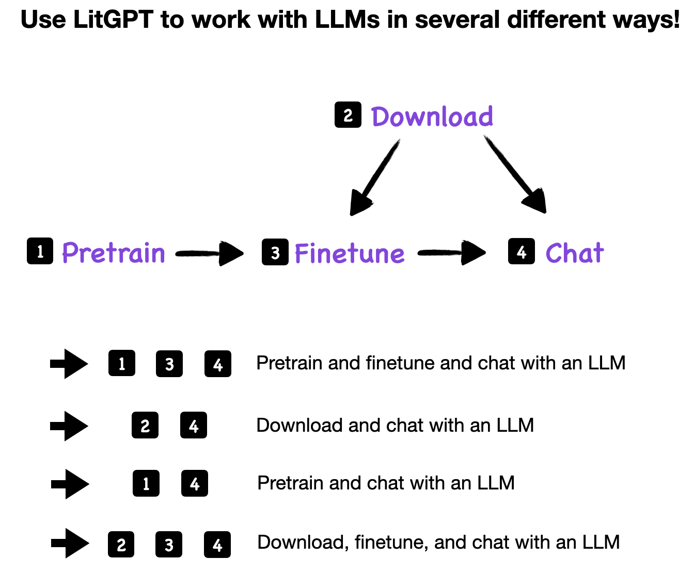
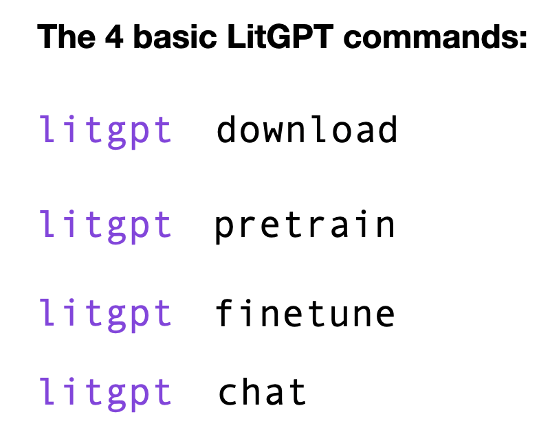
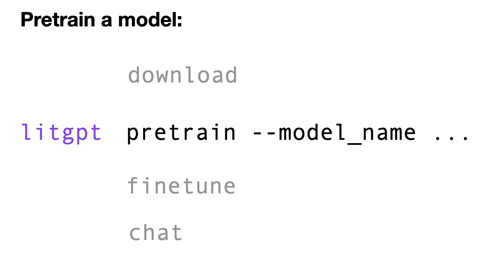
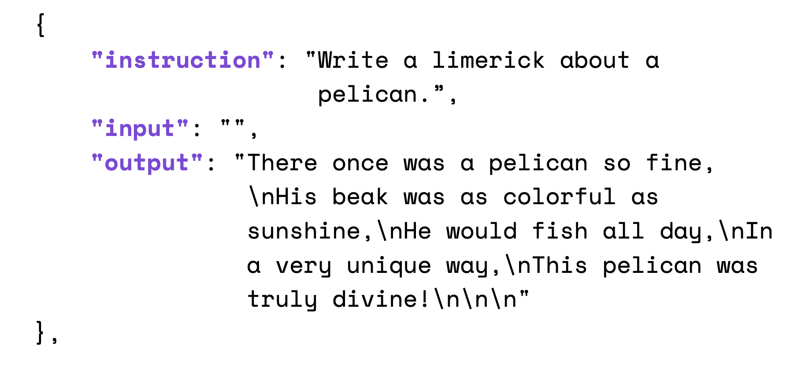
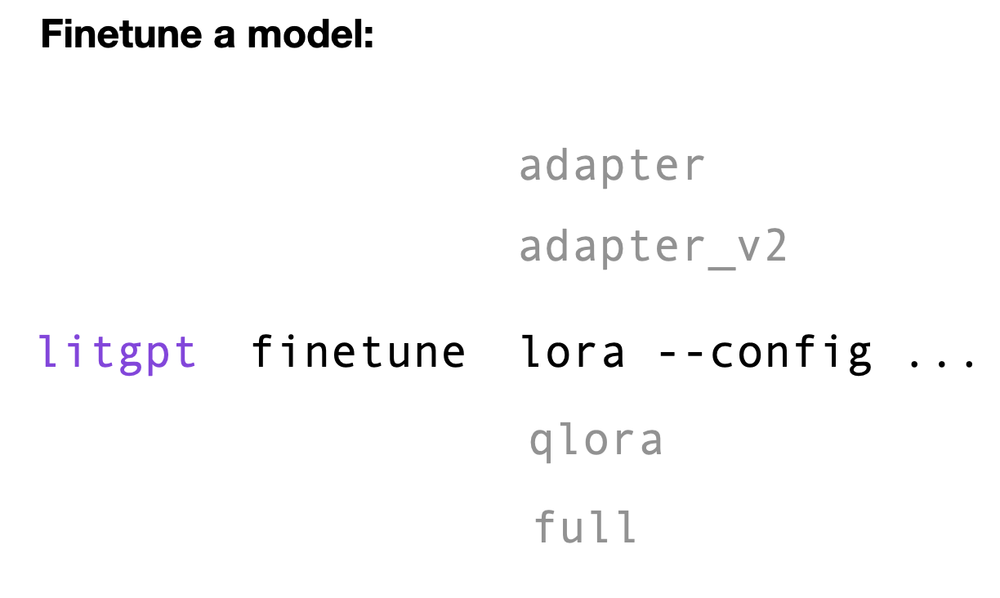

# Zero to Pretraining, Finetuning, and Using LLMs with LitGPT


This tutorial walks you through the main features and usage patterns for the LitGPT, a library for pretraining, finetuning, and using LLMs that focuses on an efficient user experience while being developer friendly.

The topics, following the installation of LitGPT, are in chronological order reflecting the steps in an LLM lifecyle: Pretraining → Finetuning → Inference.

&nbsp;



&nbsp;



&nbsp;

However, it is also possible, and even common, to use and deploy models with LitGPT without pretraining and finetuning. So, if you are not interested in pretraining and finetuning, please feel free to skip these sections.


&nbsp;
## Install LitGPT

LitGPT is available as a Python library from the PyPI package repository, and we recommend installing it using Python's `pip` installer module, including all required package dependencies:

```bash
pip install 'litgpt[all]' 
```

Alternatively, if you are a researcher or developer planning to make changes to LitGPT, you can clone the GitHub repository and install it from a local folder as follows:

```
git clone https://github.com/Lightning-AI/litgpt.git
cd litgpt
pip install -e '.[all]'
```


&nbsp;
## Pretrain LLMs

Finetuning LLMs requires substantial compute resources and time commitment. For that reason, most researchers and practitioners prefer to skip step and prefer to skip this step, downloading a pretrained LLM instead. 

However, if you are feeling adventerous and want to pretrain your own LLM, here's how.

First, we have to decide which type of model architecture we want to use. We list the available architectures by using the `pretrain` command without any additional arguments:

```bash
litgpt pretrain
```

This prints a list of all available model architectures in alphabetical order:

```
Camel-Platypus2-13B
Camel-Platypus2-70B
CodeLlama-13b-Python-hf
...
tiny-llama-1.1b
vicuna-13b-v1.3
vicuna-13b-v1.5
vicuna-13b-v1.5-16k
vicuna-33b-v1.3
vicuna-7b-v1.3
vicuna-7b-v1.5
vicuna-7b-v1.5-16k
```

Suppose we are interested in pretraining 1.1B parameter small `tiny-llama-1.1b` model. Before we can start finetuning, we also need to choose an download a tokenizer. We can do this via the `download` command. Note that running `litgpt download` without any additional arguments will also print a list of all available models and tokenizers to download. To filter for specific models, e.g., TinyLlama, we can use the `grep` command in our terminal:

```bash
litgpt download | grep  TinyLlama
```

This prints

```
TinyLlama/TinyLlama-1.1B-intermediate-step-1431k-3T
TinyLlama/TinyLlama-1.1B-Chat-v1.0
```

Let's now download the tokenizer corresponding to `TinyLlama/TinyLlama-1.1B-intermediate-step-1431k-3T` that we can then use to pretrain the TinyLlama model, which save the download tokenizer to a `checkpoints/` folder by default:

```
litgpt download \
   --repo_id TinyLlama/TinyLlama-1.1B-intermediate-step-1431k-3T \
   --tokenizer_only true
```

&nbsp;



&nbsp;

Next, we can pretrain the model on the OpenWebText dataset with default setting as follows:

```bash
litgpt pretrain \
  --model_name tiny-llama-1.1b \
  --data OpenWebText \
  --tokenizer_dir checkpoints/TinyLlama/TinyLlama-1.1B-intermediate-step-1431k-3T
```

If you are interested in additional settings, you can use the help command as follows:

```
litgpt pretrain --help
```

&nbsp;

> [!TIP]
> Above, we only covered the most basic commands for pretraining a model using LitGPT. If you are interested in pretraining a model, we highly recommend checking the resources below.

&nbsp;

**More information and additional resources**

- [tutorials/pretrain_tinyllama](./pretrain_tinyllama.md): A tutorials for finetuning a 1.1B TinyLlama model on 3 trillion tokens
- Project templates in reproducible environments with multi-GPU and multi-node support:
  - [Prepare the TinyLlama 1T token dataset](https://lightning.ai/lightning-ai/studios/prepare-the-tinyllama-1t-token-dataset)
  - [Pretrain LLMs - TinyLlama 1.1B](https://lightning.ai/lightning-ai/studios/pretrain-llms-tinyllama-1-1b)
  - [Continued Pretraining with TinyLlama 1.1B](https://lightning.ai/lightning-ai/studios/continued-pretraining-with-tinyllama-1-1b)


&nbsp;
## Download pretrained model weights

Most practical usecases, like inference (/chat) or finetuning with LLMs, involve pretrained model weights. LitGPT supports a large number of model weights, which can be listed by executing the `download` command without any additional arguments:

```bash
litgpt download
```

This will print a (long) list of all supported pretrained models (abbreviated for readability below):

```
..
google/gemma-2b
...
meta-llama/Llama-2-7b-hf
...
microsoft/phi-2
...
mistralai/Mixtral-8x7B-Instruct-v0.1
...
```

To download the model weights, simply provide one of the model strings above as a `--repo_id` argument:

```bash
litgpt download --repo_id microsoft/phi-2
```

By default, the weights are going to be stored in a `./checkpoints` subdirectory:

```bash
ls -lh checkpoints/microsoft/phi-2/
```

```
total 11G
-rw-r--r-- 1 sebastian sebastian  863 Mar 19 21:14 config.json
-rw-r--r-- 1 sebastian sebastian  124 Mar 19 21:14 generation_config.json
-rw-r--r-- 1 sebastian sebastian 5.2G Mar 19 21:15 lit_model.pth
-rw-r--r-- 1 sebastian sebastian 4.7G Mar 19 21:15 model-00001-of-00002.bin
-rw-r--r-- 1 sebastian sebastian 538M Mar 19 21:15 model-00002-of-00002.bin
-rw-r--r-- 1 sebastian sebastian  528 Mar 19 21:15 model_config.yaml
-rw-r--r-- 1 sebastian sebastian 2.1M Mar 19 21:14 tokenizer.json
-rw-r--r-- 1 sebastian sebastian 7.2K Mar 19 21:14 tokenizer_config.json
```

The model is now ready for inference and chat, for example, using the `chat` command on the checkpoint directory:

```bash
litgpt chat --checkpoint_dir checkpoints/microsoft/phi-2
```

```
Now chatting with phi-2.
To exit, press 'Enter' on an empty prompt.

Seed set to 1234
>> Prompt: Why are LLMs so useful?    
>> Reply:  When building applications or operating systems, you can use LLMs to know how a computer should respond to your commands. This can make your programs run faster and more efficiently.

Time for inference: 1.26 sec total, 27.81 tokens/sec, 35 tokens

>> Prompt: 
```


&nbsp;
**More information and additional resources**

- [tutorials/download_model_weights](download_model_weights.md): A more comprehensive download tutorial, tips for GPU memory limitations, and more


&nbsp;
## Finetune LLMs

LitGPT supports several methods supervised instruction finetuning, which allows you to finetune models to follow instructions. 

Datasets for Instruction-finetuning are usually formatted in the following way: 

&nbsp;



&nbsp;

Alternatively, datasets for instruction finetuning can also contain an `'input'` field:

In an instruction-finetuning context, "full" finetuning means that all model parameters are updated. Adapter and LoRA (short for low-rank adaptation) are methods for parameter-efficient finetuning that only require updating a small fraction of the model weights. 

&nbsp;



&nbsp;

Parameter-efficient finetuning is much more resource-efficient and cheaper than full finetuning, and it often results in the same good performance on downstream tasks. 

In the following example, we will use LoRA for finetuning, which is one of the most popular LLM finetuning method. (For more information on how LoRA works, please see [Code LoRA from Scratch](https://lightning.ai/lightning-ai/studios/code-lora-from-scratch).)

Before we start, we have to download a model as explained in the previous "Download pretrained model" section above:

```bash
litgpt download --repo_id microsoft/phi-2
```

The LitGPT interface can be used with via command line arguments and configuration files. We recommend starting out with the configuration files from the [config_hub](../config_hub) and either modifying them directly or overrriding certain settings via the command line. For example, we can use the following setting to train the downloaded 2.7B parameter `microsoft/phi-2` model, where we set `--max_steps 5` for a quick test run.

If you have downloaded or cloned the LitGPT repository, you can provide the `config` file via a relative path:

```bash
litgpt finetune lora \
  --config config_hub/finetune/phi-2/lora.yaml \
  --train.max_steps 5
```

Alternatively, you can provide an URL:

```bash
litgpt finetune lora \
  --config https://raw.githubusercontent.com/Lightning-AI/litgpt/main/config_hub/finetune/phi-2/lora.yaml \
    --train.max_steps 5
```

&nbsp;


> [!TIP]
> Note that the config file above will finetune the model on the `Alpaca2k` dataset on 1 GPU and save the resulting files in an `out/finetune/lora-phi-2` directory. All of these settings can be changed via a respective command line argument or by changing the config file. 
> To see more options, execute `litgpt finetune lora --help`.


&nbsp;

**More information and additional resources**

- [tutorials/prepare_dataset](prepare_dataset)
- [tutorials/finetune](finetune.md)
- [tutorials/finetune_full](finetune_full.md)
- [tutorials/finetune_lora](finetune_lora.md)
- [tutorials/finetune_adapter](finetune_adapter.md)
- [tutorials/oom](oom.md)
- [tutorials/quantize](quantize.md)

TODO: Mention config file resources

&nbsp;
## Inference (/chat)

&nbsp;
**More information and additional resources**

- [tutorials/inference](inference.md)


## Evaluation

&nbsp;
**More information and additional resources**

- [tutorials/evaluation](evaluation.md)
- [tutorials/convert_lit_models](convert_lit_models.md)


---

TODOS:

- [ ] Proofread
- [ ] Compress images to webp
- [ ] Link in Readme