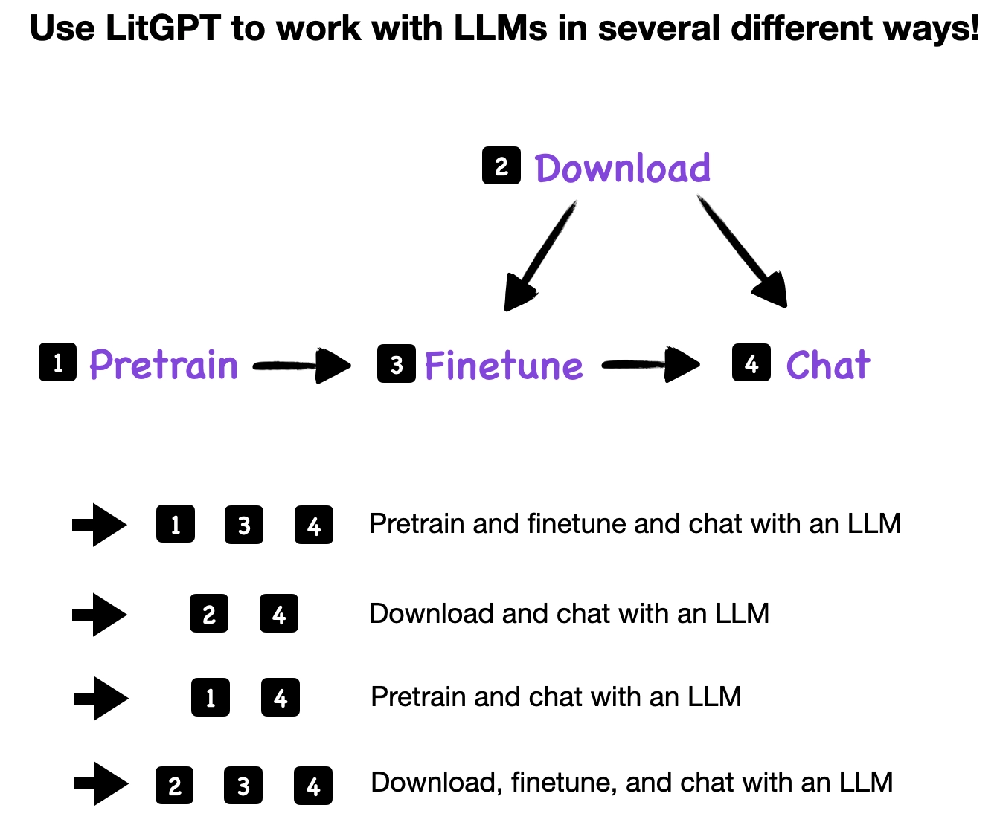
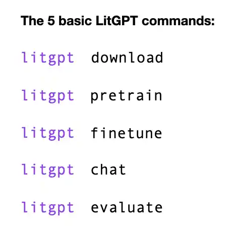
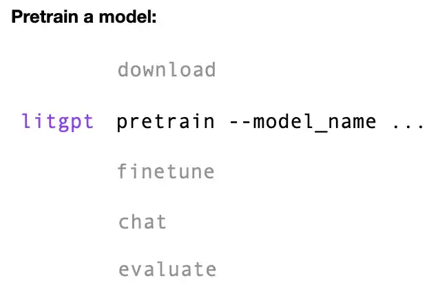

# Zero to LitGPT: Getting Started with Pretraining, Finetuning, and Using LLMs


This tutorial walks you through the main features and usage patterns for ⚡️LitGPT, a library for pretraining, finetuning, and using LLMs that focuses on an efficient user experience while being developer-friendly.

The topics, following the installation of LitGPT, are in chronological order, reflecting the steps in an LLM lifecycle: Pretraining → Finetuning → Inference.

&nbsp;



&nbsp;



&nbsp;

However, it is also possible, and even common, to use and deploy models with LitGPT without pretraining and finetuning. So, if you are not interested in pretraining and finetuning, please feel free to skip these sections.


&nbsp;
## Install LitGPT

LitGPT is available as a Python library from the PyPI package repository, and we recommend installing it using Python's `pip` installer module, including all required package dependencies:

```bash
pip install 'litgpt[all]' 
```

Alternatively, if you are a researcher or developer planning to make changes to LitGPT, you can clone the GitHub repository and install it from a local folder as follows:

```
git clone https://github.com/Lightning-AI/litgpt.git
cd litgpt
pip install -e '.[all]'
```


&nbsp;
## Pretrain LLMs

Pretraining LLMs requires substantial compute resources and time commitment. For that reason, most researchers and practitioners prefer to skip this step and continue with the *Download pretrained model weights* section instead. 

However, if you feel adventurous and want to pretrain your own LLM, here's how.

First, we have to decide which type of model architecture we want to use. We list the available architectures by using the `pretrain` command without any additional arguments:

```bash
litgpt pretrain
```

This prints a list of all available model architectures in alphabetical order:

```
Camel-Platypus2-13B
Camel-Platypus2-70B
CodeLlama-13b-Python-hf
...
tiny-llama-1.1b
vicuna-13b-v1.3
vicuna-13b-v1.5
vicuna-13b-v1.5-16k
vicuna-33b-v1.3
vicuna-7b-v1.3
vicuna-7b-v1.5
vicuna-7b-v1.5-16k
```

Suppose we want to pretraining the 1.1B parameter small `tiny-llama-1.1b` model. Before starting finetuning, we must also choose and download a tokenizer. 

We can download a tokenizer via the `download` command. Note that running `litgpt download` without any additional arguments will also print a list of all available models and tokenizers to download. 

To filter for specific models, e.g., TinyLlama, we can use the `grep` command in our terminal:

```bash
litgpt download | grep  TinyLlama
```

This prints

```
TinyLlama/TinyLlama-1.1B-intermediate-step-1431k-3T
TinyLlama/TinyLlama-1.1B-Chat-v1.0
```

Let's now download the tokenizer corresponding to `TinyLlama/TinyLlama-1.1B-intermediate-step-1431k-3T` that we can then use to pretrain the TinyLlama model, which saves the download tokenizer to a `checkpoints/` folder by default:

```
litgpt download \
   --repo_id TinyLlama/TinyLlama-1.1B-intermediate-step-1431k-3T \
   --tokenizer_only true
```

&nbsp;



&nbsp;

Next, we can pretrain the model on the OpenWebText dataset with the default setting as follows:

```bash
litgpt pretrain \
  --model_name tiny-llama-1.1b \
  --data OpenWebText \
  --tokenizer_dir checkpoints/TinyLlama/TinyLlama-1.1B-intermediate-step-1431k-3T
```

If you are interested in additional settings, you can use the help command as follows:

```
litgpt pretrain --help
```

&nbsp;

> [!TIP]
> Above, we only covered the most basic commands for pretraining a model using LitGPT. We highly recommend checking the resources below if you are interested in pretraining a model.

&nbsp;

**More information and additional resources**

- [tutorials/pretrain](./pretrain.md): General information about pretraining in LitGPT
- [tutorials/pretrain_tinyllama](./pretrain_tinyllama.md): A tutorial for finetuning a 1.1B TinyLlama model on 3 trillion tokens
- [config_hub/pretrain](../config_hub/pretrain): Pre-made config files for pretraining that work well out of the box
- Project templates in reproducible environments with multi-GPU and multi-node support:
  - [Prepare the TinyLlama 1T token dataset](https://lightning.ai/lightning-ai/studios/prepare-the-tinyllama-1t-token-dataset)
  - [Pretrain LLMs - TinyLlama 1.1B](https://lightning.ai/lightning-ai/studios/pretrain-llms-tinyllama-1-1b)
  - [Continued Pretraining with TinyLlama 1.1B](https://lightning.ai/lightning-ai/studios/continued-pretraining-with-tinyllama-1-1b)


&nbsp;
## Download pretrained model weights

Most practical use cases, like LLM inference (/chat) or finetuning, involve using pretrained model weights. LitGPT supports a large number of model weights, which can be listed by executing the `download` command without any additional arguments:

```bash
litgpt download
```

This will print a (long) list of all supported pretrained models (abbreviated for readability below):

```
..
google/gemma-2b
...
meta-llama/Llama-2-7b-hf
...
microsoft/phi-2
...
mistralai/Mixtral-8x7B-Instruct-v0.1
...
```

To download the model weights, provide one of the model strings above as a `--repo_id` argument:

```bash
litgpt download --repo_id microsoft/phi-2
```

```
model-00001-of-00002.safetensors: 100%|████████████████████████████████| 5.00G/5.00G [00:40<00:00, 124MB/s]
model-00002-of-00002.safetensors: 100%|████████████████████████████████| 564M/564M [00:01<00:00, 330MB/s]
tokenizer.json: 100%|██████████████████████████████████████████████████| 2.11M/2.11M [00:00<00:00, 54.0MB/s]
...
Converting checkpoint files to LitGPT format.
Processing checkpoints/microsoft/phi-2/model-00001-of-00002.bin
...
Saving converted checkpoint to checkpoints/microsoft/phi-2
```


&nbsp;

> [!TIP]
> Note that some models, such as Llama 2, require that you accept Meta AI's terms of service for this model, and you need to use a special access token via the `litgpt download ... --access_token ...` option. For more information, visit the respective Model Hub website, e.g., [meta-llama/Llama-2-7b-hf](https://huggingface.co/meta-llama/Llama-2-7b-hf). The access token can be created under your Model Hub in the `Profile > Access Tokens` menu.

&nbsp;


By default, the weights are going to be stored in a `./checkpoints` subdirectory:

```bash
ls -lh checkpoints/microsoft/phi-2/
```

```
total 11G
-rw-r--r-- 1 sebastian sebastian  863 Mar 19 21:14 config.json
-rw-r--r-- 1 sebastian sebastian  124 Mar 19 21:14 generation_config.json
-rw-r--r-- 1 sebastian sebastian 5.2G Mar 19 21:15 lit_model.pth
-rw-r--r-- 1 sebastian sebastian 4.7G Mar 19 21:15 model-00001-of-00002.bin
-rw-r--r-- 1 sebastian sebastian 538M Mar 19 21:15 model-00002-of-00002.bin
-rw-r--r-- 1 sebastian sebastian  528 Mar 19 21:15 model_config.yaml
-rw-r--r-- 1 sebastian sebastian 2.1M Mar 19 21:14 tokenizer.json
-rw-r--r-- 1 sebastian sebastian 7.2K Mar 19 21:14 tokenizer_config.json
```

The model is now ready for inference and chat, for example, using the `chat` command on the checkpoint directory:

```bash
litgpt chat --checkpoint_dir checkpoints/microsoft/phi-2
```

```
Now chatting with phi-2.
To exit, press 'Enter' on an empty prompt.

Seed set to 1234
>> Prompt: Why are LLMs so useful?    
>> Reply:  When building applications or operating systems, you can use LLMs to know how a computer should respond to your commands. This can make your programs run faster and more efficiently.

Time for inference: 1.26 sec total, 27.81 tokens/sec, 35 tokens

>> Prompt: 
```


&nbsp;
**More information and additional resources**

- [tutorials/download_model_weights](download_model_weights.md): A more comprehensive download tutorial, tips for GPU memory limitations, and more


&nbsp;
## Finetune LLMs

LitGPT supports several methods of supervised instruction finetuning, which allows you to finetune models to follow instructions. 

Datasets for Instruction-finetuning are usually formatted in the following way: 

&nbsp;


&nbsp;

Alternatively, datasets for instruction finetuning can also contain an `'input'` field:

In an instruction-finetuning context, "full" finetuning means updating all model parameters as opposed to only a subset. Adapter and LoRA (short for low-rank adaptation) are methods for parameter-efficient finetuning that only require updating a small fraction of the model weights. 

&nbsp;


&nbsp;

Parameter-efficient finetuning is much more resource-efficient and cheaper than full finetuning, and it often results in the same good performance on downstream tasks. 

In the following example, we will use LoRA for finetuning, which is one of the most popular LLM finetuning methods. (For more information on how LoRA works, please see [Code LoRA from Scratch](https://lightning.ai/lightning-ai/studios/code-lora-from-scratch).)

Before we start, we have to download a model as explained in the previous "Download pretrained model" section above:

```bash
litgpt download --repo_id microsoft/phi-2
```

The LitGPT interface can be used via command line arguments and configuration files. We recommend starting with the configuration files from the [config_hub](../config_hub) and either modifying them directly or overriding specific settings via the command line. For example, we can use the following setting to train the downloaded 2.7B parameter `microsoft/phi-2` model, where we set `--max_steps 5` for a quick test run.

If you have downloaded or cloned the LitGPT repository, you can provide the `config` file via a relative path:

```bash
litgpt finetune lora \
  --config config_hub/finetune/phi-2/lora.yaml \
  --train.max_steps 5
```

Alternatively, you can provide a URL:

```bash
litgpt finetune lora \
  --config https://raw.githubusercontent.com/Lightning-AI/litgpt/main/config_hub/finetune/phi-2/lora.yaml \
  --train.max_steps 5
```


&nbsp;


> [!TIP]
> Note that the config file above will finetune the model on the `Alpaca2k` dataset on 1 GPU and save the resulting files in an `out/finetune/lora-phi-2` directory. All of these settings can be changed via a respective command line argument or by changing the config file. 
> To see more options, execute `litgpt finetune lora --help`.

&nbsp;

Running the previous finetuning command will initiate the finetuning process, which should only take about a minute on a GPU due to the `--train.max_steps 5` setting.

```
{'checkpoint_dir': PosixPath('checkpoints/microsoft/phi-2'),
 'data': Alpaca2k(mask_prompt=False,
                  val_split_fraction=0.03847,
                  prompt_style=<litgpt.prompts.Alpaca object at 0x7f5fa2867e80>,
                  ignore_index=-100,
                  seed=42,
                  num_workers=4,
                  download_dir=PosixPath('data/alpaca2k')),
 'devices': 1,
 'eval': EvalArgs(interval=100, max_new_tokens=100, max_iters=100),
 'logger_name': 'csv',
 'lora_alpha': 16,
 'lora_dropout': 0.05,
 'lora_head': True,
 'lora_key': True,
 'lora_mlp': True,
 'lora_projection': True,
 'lora_query': True,
 'lora_r': 8,
 'lora_value': True,
 'out_dir': PosixPath('out/finetune/lora-phi-2'),
 'precision': 'bf16-true',
 'quantize': None,
 'seed': 1337,
 'train': TrainArgs(save_interval=800,
                    log_interval=1,
                    global_batch_size=8,
                    micro_batch_size=4,
                    lr_warmup_steps=10,
                    epochs=1,
                    max_tokens=None,
                    max_steps=5,
                    max_seq_length=512,
                    tie_embeddings=None,
                    learning_rate=0.0002,
                    weight_decay=0.0,
                    beta1=0.9,
                    beta2=0.95,
                    max_norm=None,
                    min_lr=6e-05)}
Seed set to 1337
Number of trainable parameters: 12,226,560
Number of non-trainable parameters: 2,779,683,840
The longest sequence length in the train data is 512, the model's maximum sequence length is 512 and context length is 2048
Validating ...
Recommend a movie for me to watch during the weekend and explain the reason.
Below is an instruction that describes a task. Write a response that appropriately completes the request.

### Instruction:
Recommend a movie for me to watch during the weekend and explain the reason.

### Response:
I recommend you watch "Parasite" because it's a critically acclaimed movie that won multiple awards, including the Academy Award for Best Picture. It's a thought-provoking and suspenseful film that will keep you on the edge of your seat. The movie also tackles social and economic inequalities, making it a must-watch for anyone interested in meaningful storytelling.

/home/zeus/miniconda3/envs/cloudspace/lib/python3.10/site-packages/torchmetrics/utilities/prints.py:43: UserWarning: The ``compute`` method of metric MeanMetric was called before the ``update`` method which may lead to errors, as metric states have not yet been updated.
  warnings.warn(*args, **kwargs)  # noqa: B028
Missing logger folder: out/finetune/lora-phi-2/logs/csv
Epoch 1 | iter 1 step 0 | loss train: 1.646, val: n/a | iter time: 820.31 ms
Epoch 1 | iter 2 step 1 | loss train: 1.660, val: n/a | iter time: 548.72 ms (step)
Epoch 1 | iter 3 step 1 | loss train: 1.687, val: n/a | iter time: 300.07 ms
Epoch 1 | iter 4 step 2 | loss train: 1.597, val: n/a | iter time: 595.27 ms (step)
Epoch 1 | iter 5 step 2 | loss train: 1.640, val: n/a | iter time: 260.75 ms
Epoch 1 | iter 6 step 3 | loss train: 1.703, val: n/a | iter time: 568.22 ms (step)
Epoch 1 | iter 7 step 3 | loss train: 1.678, val: n/a | iter time: 511.70 ms
Epoch 1 | iter 8 step 4 | loss train: 1.741, val: n/a | iter time: 514.14 ms (step)
Epoch 1 | iter 9 step 4 | loss train: 1.689, val: n/a | iter time: 423.59 ms
Epoch 1 | iter 10 step 5 | loss train: 1.524, val: n/a | iter time: 603.03 ms (step)
Training time: 11.20s
Memory used: 13.90 GB
Saving LoRA weights to 'out/finetune/lora-phi-2/final/lit_model.pth.lora'
Saved merged weights to 'out/finetune/lora-phi-2/final/lit_model.pth'
```

Notice that the LoRA script saves both the LoRA weights (`'out/finetune/lora-phi-2/final/lit_model.pth.lora'`) and the LoRA weight merged back into the original model (`'out/finetune/lora-phi-2/final/lit_model.pth'`) for convenience. This allows us to use the finetuned model via the `chat` function directly:

```bash
litgpt chat --checkpoint_dir out/finetune/lora-phi-2/final/
```

```
Now chatting with phi-2.
To exit, press 'Enter' on an empty prompt.

Seed set to 1234
>> Prompt: Why are LLMs so useful?   
>> Reply: LLMs are useful because they can be trained to perform various natural language tasks, such as language translation, text generation, and question-answering. They are also able to understand the context of the input data, which makes them particularly useful for tasks such as sentiment analysis and text summarization. Additionally, because LLMs can learn from large amounts of data, they are able to generalize well and perform well on new data.

Time for inference: 2.15 sec total, 39.57 tokens/sec, 85 tokens

>> Prompt: 
```


&nbsp;

**More information and additional resources**

- [tutorials/prepare_dataset](prepare_dataset.md): A summary of all out-of-the-box supported datasets in LitGPT and utilities for preparing custom datasets
- [tutorials/finetune](finetune.md): An overview of the different finetuning methods supported in LitGPT
- [tutorials/finetune_full](finetune_full.md): A tutorial on full-parameter finetuning
- [tutorials/finetune_lora](finetune_lora.md): Options for parameter-efficient finetuning with LoRA and QLoRA
- [tutorials/finetune_adapter](finetune_adapter.md): A description of the parameter-efficient Llama-Adapter methods supported in LitGPT 
- [tutorials/oom](oom.md): Tips for dealing with out-of-memory (OOM) errors
- [config_hub/finetune](../config_hub/finetune): Pre-made config files for finetuning that work well out of the box

&nbsp;
## LLM inference

To use a downloaded or finetuned model for chat, you only need to provide the corresponding checkpoint directory containing the model and tokenizer files. For example, to chat with the phi-2 model from Microsoft, download it as follows, as described in the "Download pretrained model" section:

```bash
litgpt download --repo_id microsoft/phi-2
```

```
model-00001-of-00002.safetensors: 100%|████████████████████████████████| 5.00G/5.00G [00:40<00:00, 124MB/s]
model-00002-of-00002.safetensors: 100%|████████████████████████████████| 564M/564M [00:01<00:00, 330MB/s]
tokenizer.json: 100%|██████████████████████████████████████████████████| 2.11M/2.11M [00:00<00:00, 54.0MB/s]
...
Converting checkpoint files to LitGPT format.
Processing checkpoints/microsoft/phi-2/model-00001-of-00002.bin
...
Saving converted checkpoint to checkpoints/microsoft/phi-2
```


Then, chat with the model using the following command:

```bash
litgpt chat --checkpoint_dir checkpoints/microsoft/phi-2
```

```
Now chatting with phi-2.
To exit, press 'Enter' on an empty prompt.

Seed set to 1234
>> Prompt: What is the main difference between a large language model and a traditional search engine?
>> Reply:  A large language model uses deep learning algorithms to analyze and generate natural language, while a traditional search engine uses algorithms to retrieve information from web pages.

Time for inference: 1.14 sec total, 26.26 tokens/sec, 30 tokens
```

> [!TIP]
> Most model weights are already represented in an efficient bfloat16 format. However, if the model currently exceeds your GPU memory, you can try to pass the `--precision bf16-true` option. In addition, you can check the quantization documentation for further optimization, which is linked below.


&nbsp;
**More information and additional resources**

- [tutorials/inference](inference.md): Chat and inference tutorial
- [tutorials/quantize](quantize.md): Quantizing models to reduce GPU memory requirements


&nbsp;
## Evaluating models

LitGPT comes with a handy `litgpt evaluate` command to evaluate models with [Eleuther AI's Evaluation Harness](https://github.com/EleutherAI/lm-evaluation-harness). For example, to evaluate the previously downloaded `microsoft/phi-2` model on several tasks available from the Evaluation Harness, you can use the following command:

```bash
litgpt evaluate \
  --checkpoint_dir checkpoints/microsoft/phi-2
  --batch_size 16 \
  --tasks "hellaswag,gsm8k,truthfulqa_mc2,mmlu,winogrande,arc_challenge"
```

(A list of supported tasks can be found [here](https://github.com/EleutherAI/lm-evaluation-harness/blob/master/docs/task_table.md).)


&nbsp;
## Deploy LLMs

You can deploy LitGPT LLMs using your tool of choice. Below is an example using LitGPT built-in serving capabilities:


```bash
# 1) Download a pretrained model (alternatively, use your own finetuned model)
litgpt download --repo_id microsoft/phi-2

# 2) Start the server
litgpt serve --checkpoint_dir checkpoints/microsoft/phi-2
```

```python
# 3) Use the server (in a separate session)
import requests, json
 response = requests.post(
     "http://127.0.0.1:8000/predict", 
     json={"prompt": "Fix typos in the following sentence: Exampel input"}
)
print(response.content)
```

This prints:

```
b'{"output":"Instruct: Fix typos in the following sentence: Exampel input\\nOutput: Example input: Hello World\\n"}'
```


&nbsp;
**More information and additional resources**

- [tutorials/deploy](deploy.md): A full deployment tutorial and example


&nbsp;
## Converting LitGPT model weights to `safetensors` format

Sometimes, it can be useful to convert LitGPT model weights for third-party and external tools. For example, we can convert a LitGPT model to the Hugging Face format and save it via `.safetensors` files.

The `--checkpoint_dir` argument provided below points to a directory corresponding to a downloaded or finetuned model (see the *Download pretrained model* or *Finetune LLMs* sections above for more information):


```bash
litgpt convert from_litgpt \
    --checkpoint_dir checkpoints/microsoft/phi-2 \
    --output_dir out/converted_model/
```

Certain tools like the `.from_pretrained` method in Hugging Face `transformers` also require the original `config.json` file that originally came with the downloaded model:

```bash
cp checkpoints/microsoft/phi-2/config.json out/converted_model/config.json
```

You can now load the model into a Hugging Face transformers model and safe it in a `.safetensors` format as follows:

```bash
import torch
from transformers import AutoModel

# Load model
state_dict = torch.load('out/converted_model/model.pth')
model = AutoModel.from_pretrained(
    "microsoft/phi-2", state_dict=state_dict
)

# Save .safetensors files
model.save_pretrained("out/converted_model/")
```

```
⚡ ~/litgpt ls -lh out/converted_model
total 16G
-rwxr--r-- 1 sebastian sebastian  891 Mar 20 17:08 config.json
-rw-r--r-- 1 sebastian sebastian 4.7G Mar 20 17:08 model-00001-of-00003.safetensors
-rw-r--r-- 1 sebastian sebastian 4.7G Mar 20 17:09 model-00002-of-00003.safetensors
-rw-r--r-- 1 sebastian sebastian 601M Mar 20 17:09 model-00003-of-00003.safetensors
-rw-r--r-- 1 sebastian sebastian 5.2G Mar 20 16:30 model.pth
-rw-r--r-- 1 sebastian sebastian  33K Mar 20 17:09 model.safetensors.index.json
```

You can then use the model with external tools, for example, Eleuther AI's [LM Evaluation Harness](https://github.com/EleutherAI/lm-evaluation-harness) (see the `lm_eval` installation instructions [here](https://github.com/EleutherAI/lm-evaluation-harness?tab=readme-ov-file#install)).

The LM Evaluation Harness requires a tokenizer to be present in the model checkpoint folder, which we can copy from the original download checkpoint:

```bash
# Copy the tokenizer needed by the Eval Harness
cp checkpoints/microsoft/phi-2/tokenizer*
out/converted_model
```

Then, we can run the Evaluation Harness as follows:

```bash
lm_eval --model hf \
    --model_args pretrained="out/converted_model" \
    --tasks "hellaswag,gsm8k,truthfulqa_mc2,mmlu,winogrande,arc_challenge" \
    --device "cuda:0" \
    --batch_size 4
```

&nbsp;

> [!TIP]
> The Evaluation Harness tasks above are those used in Open LLM Leaderboard. You can find a list all supported tasks [here](https://github.com/EleutherAI/lm-evaluation-harness/blob/master/docs/task_table.md).


&nbsp;
**More information and additional resources**

- [tutorials/convert_lit_models](./convert_lit_models.md): Tutorial on converting LitGPT weights


&nbsp;

## Get involved!

We appreciate your feedback and contributions. If you have feature requests, questions, or want to contribute code or config files, please don't hesitate to use the [GitHub Issue](https://github.com/Lightning-AI/litgpt/issues) tracker.

We welcome all individual contributors, regardless of their level of experience or hardware. Your contributions are valuable, and we are excited to see what you can accomplish in this collaborative and supportive environment.

&nbsp;

> [!TIP]
> Unsure about contributing? Check out our [How to Contribute to LitGPT](https://lightning.ai/pages/community/tutorial/how-to-contribute-to-litgpt/) guide.

&nbsp;

If you have general questions about building with LitGPT, please [join our Discord](https://discord.gg/VptPCZkGNa).
