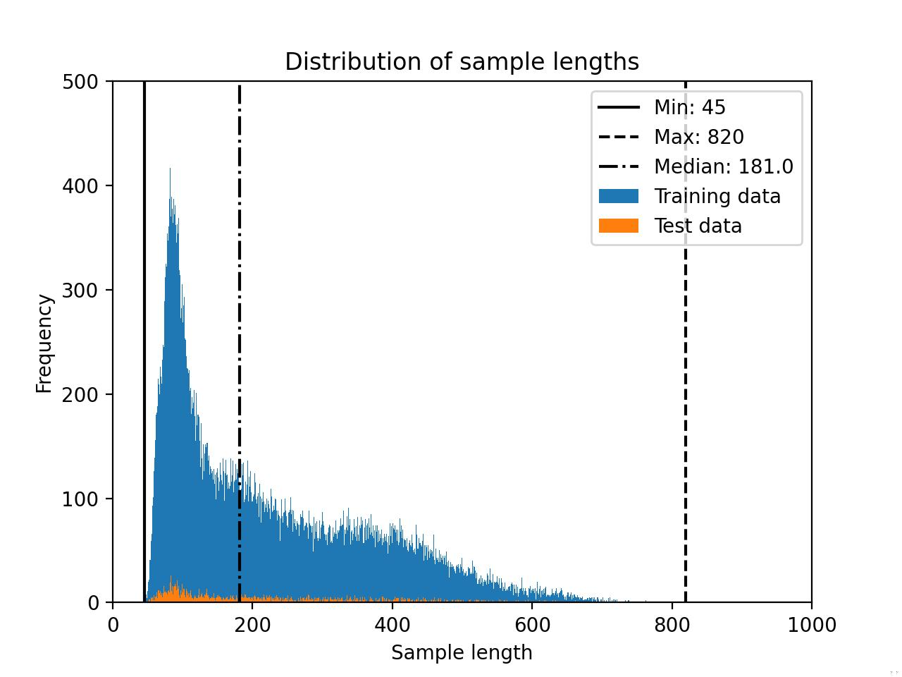
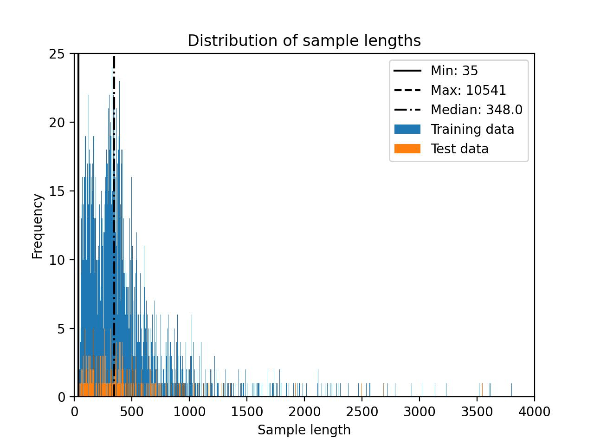

# Preparing Datasets

Below is a table of all datasets that are currently supported in LitGPT:

| Name         | Task        | Size                | Reference Repo                                                                       | Paper / Blog                                                                                                              | Data License                                                                                                                                                                                                     |
|--------------|-------------|---------------------|--------------------------------------------------------------------------------------|---------------------------------------------------------------------------------------------------------------------------|------------------------------------------------------------------------------------------------------------------------------------------------------------------------------------------------------------------|
| Alpaca       | Finetuning  | 51,759 samples      | [URL](https://github.com/tatsu-lab/stanford_alpaca)                                  | [URL](https://crfm.stanford.edu/2023/03/13/alpaca.html)                                                                   | Attribution-NonCommercial 4.0 International, [URL](https://crfm.stanford.edu/2023/03/13/alpaca.html)                                                                                                             |
| Alpaca-2k    | Finetuning  | 2000 samples        | [URL](https://huggingface.co/datasets/mhenrichsen/alpaca_2k_test)                    | See Alpaca above                                                                                                          | See Alpaca Above                                                                                                                                                                                                 |
| Alpaca-GPT4  | Finetuning  | 52,002 samples      | [URL](https://github.com/Instruction-Tuning-with-GPT-4/GPT-4-LLM)                    | [URL](https://arxiv.org/abs/2304.03277)                                                                                   | Attribution-NonCommercial 4.0 International, [URL](https://github.com/Instruction-Tuning-with-GPT-4/GPT-4-LLM/blob/main/DATA_LICENSEl)                                                                           |
| Alpaca Libre | Finetuning  | 55,370 samples      | [URL](https://github.com/mobarski/alpaca-libre)                                      | -                                                                                                                         | CC0/MIT,  [URL](https://github.com/mobarski/alpaca-libre)                                                                                                                                                        |
| Deita        | Finetuning  | 9,500 samples       | [URL](https://huggingface.co/datasets/HuggingFaceH4/deita-10k-v0-sft/tree/main/data) | [URL](https://arxiv.org/abs/2312.15685)                                                                                   | MIT [URL](https://huggingface.co/datasets/hkust-nlp/deita-10k-v0/blob/main/README.md)                                                                                                                            |
| Dolly        | Finetuning  | 15,011 samples      | [URL](https://github.com/databrickslabs/dolly/tree/master/data)                      | [URL](https://www.databricks.com/blog/2023/04/12/dolly-first-open-commercially-viable-instruction-tuned-llm)              | CC-BY-SA, [URL](https://github.com/databrickslabs/dolly#model-overview)                                                                                                                                          |
| FLAN         | Finetuning  | 1,753,240 samples   | [UR](https://huggingface.co/datasets/Muennighoff/flan)                               | [URL](https://blog.research.google/2023/02/the-flan-collection-advancing-open.html)                                       | Subset dependent                                                                                                                                                                                                 |
| LongForm     | Finetuning  | 23,652 samples      | [URL](https://github.com/akoksal/LongForm)                                           | [URL](https://arxiv.org/abs/2304.08460)                                                                                   | No information provided and subset-dependent, [URL](https://github.com/akoksal/LongForm)                                                                                                                         |
| LIMA         | Finetuning  | 1,084 samples       | [URL](https://huggingface.co/datasets/GAIR/lima)                                     | [URL](https://arxiv.org/abs/2305.11206)                                                                                   | "If the source data of LIMA has a stricter license than CC BY-NC-SA, the LIMA dataset follows the same. Otherwise, it follows the CC BY-NC-SA license", [URL](https://huggingface.co/datasets/GAIR/lima#license) |
| OpenWeb Text | Pretraining | 8,013,769 documents | [URL](https://github.com/jcpeterson/openwebtext)                                     | [URL](https://d4mucfpksywv.cloudfront.net/better-language-models/language_models_are_unsupervised_multitask_learners.pdf) | Unspecified                                                                                                                                                                                                      |
| TinyLlama    | Pretraining | 1 T tokens          | [URL](https://github.com/jzhang38/TinyLlama)                                         | [URL](https://arxiv.org/abs/2401.02385)                                                                                   |                                                                                                                                                                                                                  |
| TinyStories  | Pretraining | 4,967,871 stories   | [URL](https://huggingface.co/datasets/roneneldan/TinyStories)                        | [URL](https://arxiv.org/abs/2305.07759)                                                                                   | CDLA-Sharing-1.0                                                                                                                                                                                                 |

&nbsp;

## Preparation

The steps here only need to be done once before preparing the finetuning datasets in the following subsections:

1. Follow the instructions in the [README](../README.md) to install the dependencies.
2. Download and convert the weights following our [guide](download_model_weights.md).

For the following examples, we will focus on finetuning with the `litgpt/finetune/lora.py` script and use a Falcon 7B model.
However, the same steps apply to all other models and finetuning scripts.
Please read the [tutorials/finetune_*.md](.) documents for more information about finetuning models.

> [!IMPORTANT]
> By default, the maximum sequence length is obtained from the model configuration file. In case you run into out-of-memory errors, especially in the cases of LIMA and Dolly,
> you can try to lower the context length by setting the `--train.max_seq_length` parameter, for example, `litgpt finetune lora --train.max_seq_length 256`. For more information on truncating datasets, see the *Truncating datasets* section in the Alpaca section near the top of this article.

&nbsp;

### Alpaca

&nbsp;

The Alpaca dataset consists of 52,000 instructions and demonstrations produced by OpenAI's text-davinci-003 engine. This data is used in instruction-tuning, helping improve the performance of language models to follow instructions.

In its development, the creators leveraged the data generation methodology from the [Self-Instruct framework](https://github.com/yizhongw/self-instruct).

The original [Alpaca](https://crfm.stanford.edu/2023/03/13/alpaca.html) dataset can be used as follows:

```bash
litgpt finetune lora \
  --data Alpaca \
  --checkpoint_dir "checkpoints/tiiuae/falcon-7b"
```

#### Truncating datasets

By default, the finetuning scripts will determine the size of the longest tokenized sample in the dataset to determine the block size. However, if you are willing to truncate a few examples in the training set, you can reduce the computational resource requirements significantly. For instance you can set a sequence length threshold via `--train.max_seq_length`. We can determine an appropriate maximum sequence length by considering the distribution of the data sample lengths shown in the histogram below.


In this case, a cut-off of 256 may be a reasonable choice:

```bash
litgpt finetune lora \
  --data Alpaca \
  --checkpoint_dir "checkpoints/tiiuae/falcon-7b" \
  --train.max_seq_length 256
```

For comparison, the Falcon 7B model requires 23.52 GB of memory for the original Alpaca dataset and 15.73 GB of memory for the truncated Alpaca dataset when finetuning with LoRA using a micro batchsize of 1 and bfloat-16 precision.

&nbsp;

### Alpaca-2k

[Alpaca-2k](https://huggingface.co/datasets/mhenrichsen/alpaca_2k_test) is a smaller, 2000-sample subset of Alpaca described above.


### Alpaca-GPT4


The Alpaca-GPT4 was built by using the prompts of the original Alpaca dataset and generate the responses via GPT 4. The 
dataset consists of 52,000 instructions and responses.

The original [Alpaca-GPT4](https://github.com/Instruction-Tuning-with-GPT-4/GPT-4-LLM) dataset can be used as follows:

```bash
litgpt finetune lora \
  --data AlpacaGPT4 \
  --checkpoint_dir "checkpoints/tiiuae/falcon-7b"
```

The Alpaca-GPT4 dataset distribution is shown below.



&nbsp;

### Alpaca Libre

[Alpaca Libre](https://github.com/mobarski/alpaca-libre) is a reimplementation or alternative to Alpaca using the same formatting.

To use Alpaca Libre instead of the original Alpaca dataset, use the following command:

```bash
litgpt finetune lora \
  --data Alpaca \
  --data.file_url "https://raw.githubusercontent.com/mobarski/alpaca-libre/main/data/output/alpaca_libre_ok_tasks_v4.json" \
  --data.file_name "alpaca_libre_data_cleaned_archive.json" \
  --checkpoint_dir "checkpoints/tiiuae/falcon-7b"
```

The Alpaca Libre dataset distribution is shown below.


You may want to consider truncating the dataset (see the *Truncating datasets* discussion in the Alpaca section for more information.) For this dataset, a cut-off of 256 may be a good choice:

```bash
litgpt finetune lora \
  --data Alpaca \
  --data.file_url "https://raw.githubusercontent.com/mobarski/alpaca-libre/main/data/output/alpaca_libre_ok_tasks_v4.json" \
  --data.file_name "alpaca_libre_data_cleaned_archive.json" \
  --checkpoint_dir "checkpoints/tiiuae/falcon-7b" \
  --train.max_seq_length 256
```


&nbsp;

### Deita

The Deita dataset (short for Data-Efficient Instruction Tuning for Alignment) is a collection of 9500 prompts and responses, as described in the [What Makes Good Data for Alignment? A Comprehensive Study of Automatic Data Selection in Instruction Tuning](https://arxiv.org/abs/2312.15685) paper. 
Using Falcon 7b as an example, we can use the dataset as follows:

```bash
litgpt finetune lora \
  --data Deita \
  --checkpoint_dir "checkpoints/tiiuae/falcon-7b"
```

Deita contains multiturn conversations. By default, only the first instruction-response pairs from
each of these multiturn conversations are included. If you want to override this behavior and include the follow-up instructions
and responses, set `--data.include_multiturn_conversations True`, which will include all multiturn conversations as regular
prompt-response pairs. Considering the multiturn-answers, the dataset consists of 209,272 prompt-response pairs.

The Deita dataset distribution without including multit-turn conversations is shown below.



The Deita dataset distribution including multit-turn conversations is depicted in the following histogram.


You may want to consider truncating the dataset (see the *Truncating datasets* discussion in the Alpaca section for more information.) For this dataset, a cut-off of 512 may be a good choice:

```bash
litgpt finetune lora \
  --data Deita \
  --checkpoint_dir "checkpoints/tiiuae/falcon-7b" \
  --train.max_seq_length 512
```


&nbsp;

### Dolly

The Dolly dataset is a publicly available collection of 15k instruction-following entries created by Databricks. It spans multiple behavioral domains, as described in the [InstructGPT paper](https://arxiv.org/abs/2203.02155) paper. These include areas like brainstorming, classification, closed QA, content creation, information retrieval, open QA, and summary generation.

The usage is similar to the Alpaca dataset described above. Using Falcon 7b as an example, we can use the dataset as follows:

```bash
litgpt finetune lora \
  --data Dolly \
  --checkpoint_dir "checkpoints/tiiuae/falcon-7b" \
```

The Dolly dataset distribution is shown below.


You may want to consider truncating the dataset (see the *Truncating datasets* discussion in the Alpaca section for more information.) For this dataset, a cut-off of 512 may be a good choice:

```bash
litgpt finetune lora \
  --data Dolly \
  --checkpoint_dir "checkpoints/tiiuae/falcon-7b" \
  --train.max_seq_length 256
```

&nbsp;

### LongForm

LongForm is a semi-synthetic dataset based on raw text corpora for which the instructions were generated via an LLM. For more details about the instruction-generation process, please refer to the [LongForm research paper](https://arxiv.org/abs/2304.08460) by Köksal et al. According to the research paper, a Llama 7B model trained on LongForm achieves substantially better performance than the same Llama model trained on the 2x larger Alpaca dataset.

LongForm consists of 23,652 training samples, 2,042 validation samples, and 2,045 test samples. (In LitGPT, the validation samples are currently not used.)

The more detailed dataset composition is as follows based on a table taken from the [dataset repository](https://github.com/akoksal/LongForm):

| **Type**               | **Source**     | **Number of Examples** |
|------------------------|----------------|------------------------|
| **Corpora**            | C4             | 10,000                 |
|                        | Wikipedia      | 5,000                  |
| **Structured Corpora** | Stack Exchange | 4,380                  |
|                        | WikiHow        | 2,500                  |
| **Tasks**              | NIv2           | 3,684                  |
|                        | Big Bench      | 600                    |
|                        | BEA-GEC        | 1,203                  |
|                        | Enron          | 372                    |
| **Total**              |                | 27,739                 |
|                        |                |                        |
| **Train**              |                | 23,652                 |
| **Validation**         |                | 2,042                  |
| **Test**               |                | 2,045                  |

License information is not provided but would depend on the individual subsets listed above.

The LongForm dataset distribution is shown below.


You may want to consider truncating the dataset (see the *Truncating datasets* discussion in the Alpaca section for more information.) For this dataset, a cut-off of 1500 may be a good choice:

```bash
litgpt finetune lora \
  --data LongForm \
  --checkpoint_dir "checkpoints/tiiuae/falcon-7b" \
  --train.max_seq_length 1500
```

&nbsp;

### LIMA

The LIMA dataset is a collection of 1,000 carefully curated prompts and responses, as described in the [LIMA: Less Is More for Alignment](https://arxiv.org/abs/2305.11206) paper. The dataset is sourced from three community Q&A websites: Stack Exchange, wikiHow, and the Pushshift Reddit Dataset. In addition, it also contains prompts and answers written and collected by the authors of the LIMA paper.

The usage is similar to the Dolly dataset described above except that it requires an Hugging Face access token that you need to copy & paste from your Hugging Face account. Using Falcon 7b as an example, we can use the dataset as follows:

```bash
export HF_TOKEN="insert_your_huggingface_token_here"

litgpt finetune lora \
  --data LIMA \
  --checkpoint_dir "checkpoints/tiiuae/falcon-7b"
```

LIMA contains a handful of multiturn conversations. By default, only the first instruction-response pairs from
each of these multiturn conversations are included. If you want to override this behavior and include the follow-up instructions
and responses, set `--data.include_multiturn_conversations True`.

The LIMA dataset distribution is shown below.


You may want to consider truncating the dataset (see the *Truncating datasets* discussion in the Alpaca section for more information.) For this dataset, a cut-off of 512 may be a good choice:

```bash
litgpt finetune lora \
  --data LIMA \
  --checkpoint_dir "checkpoints/tiiuae/falcon-7b" \
  --train.max_seq_length 512
```

&nbsp;

### FLAN

FLAN is a collection of several datset subsets by Google. In particular, the provided script in LitGPT loads the subsets from
[here](https://huggingface.co/datasets/Muennighoff/flan).

By default, all subsets (1,386,050 samples) and validations sets (367,190 subsets) are combined into a single dataset:

```bash
litgpt finetune lora \
  --data FLAN \
  --checkpoint_dir "checkpoints/tiiuae/falcon-7b"
```

However, you can also select individual subsets via comma-separated strings as follows:


```bash
litgpt finetune lora \
  --data FLAN \
  --data.subsets "aeslc_10templates,ag_news_subset_10templates,anli_r1_10templates" \
  --checkpoint_dir "checkpoints/tiiuae/falcon-7b"
```

You can find a list of all 66 supported subsets [here](https://huggingface.co/datasets/Muennighoff/flan).

&nbsp;

## Preparing Custom Datasets for Instruction Finetuning

The models in LitGPT expect datasets for instruction finetuning in the following format:

```text
[
    {
        "instruction": "Write a limerick about a
                        pelican.”,
        "input": "",
        "output": "There once was a pelican so fine,
                   \nHis beak was as colorful as
                   sunshine,\nHe would fish all day,\nIn
                   a very unique way,\nThis pelican was
                   truly divine!\n\n\n"
    },
    {
        "instruction": "Identify the odd one out from
                        the group.",
        "input": "Carrot, Apple, Banana, Grape",
        "output": "Carrot\n\n"
    },
]
```

(Note that depending on the task, the `"input"` text can be an empty string, as shown above.)

You can use your own data in LitGPT by either reading in a JSON file in the format shown above or by implementing a custom `DataModule`.

&nbsp;

### Preparing Custom Datasets From a JSON File

You can prepare custom dataset using a JSON file where each row is a dictionary with these keys:

- `instruction`: Column which will describe the task.
- `input`: A string holding a special input value for the instruction. This applies to some samples, and in others, this is empty (empty string).
- `output`: The expected response

> If any of the fields are missing, then the script will fail to read the dataset.

Then simply run any of the finetuning scripts with this input:

```bash
litgpt finetune lora \
  --data JSON \
  --data.json_path path/to/your/data.json \
  --checkpoint_dir "checkpoints/tiiuae/falcon-7b"
```

You can also customize how the dataset is read by using these additional parameters

- `val_split_fraction`: The fraction of the data to split. Defaults to `0.1`

- `seed`: The seed value to reproduce the same random splits for train and test data.

- `mask_inputs`: Whether to mask the prompt section from the label (with `ignore_index`).

- `ignore_index`: The index to use for labels that should be ignored. Defaults to `-100` (used when `mask_inputs` is `True`).

To use the settings described above, you can add the respective command line arguments when calling the finetuning scripts as shown in the example below:

```bash
litgpt finetune lora \
  --data JSON \
  --data.json_path path/to/your/data.json \
  --data.val_split_fraction 0.1 \
  --data.seed 42 \
  --data.mask_inputs False \
  --data.ignore_index -100 \
  --checkpoint_dir "checkpoints/tiiuae/falcon-7b"
```

You can also pass a directory containing a `train.json` and `val.json` to `--data.json_path` to define a fixed train/val split.

&nbsp;

### Preparing Custom Datasets Using DataModule

If you don't have a JSON file following the format described in the previous section, the easiest way to prepare a new dataset is to copy and modify one of the existing data modules in LitGPT:

- [`litgpt/data/alpaca.py`](https://github.com/Lightning-AI/litgpt/blob/main/litgpt/data/alpaca.py) (if you plan to load a dataset from a JSON file);
- [`litgpt/data/lima.py`](https://github.com/Lightning-AI/litgpt/blob/main/litgpt/data/lima.py) (if you plan to load a dataset using the `datasets` Python library).

Note that you only need to modify a small fraction of the code file, namely the portion that downloads and formats the training data (see the `prepare_data` and `setup()` methods).

&nbsp;

## Preparing Pretraining Datasets

In addition to the finetuning dataset described above, LitGPT also supports several datasets for pretraining. The pretraining datasets are described in more detail in the following separate tutorial documents:

- [Pretrain Llama 2 on OpenWebText](./pretrain_openwebtext.md)
- [Pretrain TinyLlama on Slimpajama and Starcoder](./pretrain_tinyllama.md)
